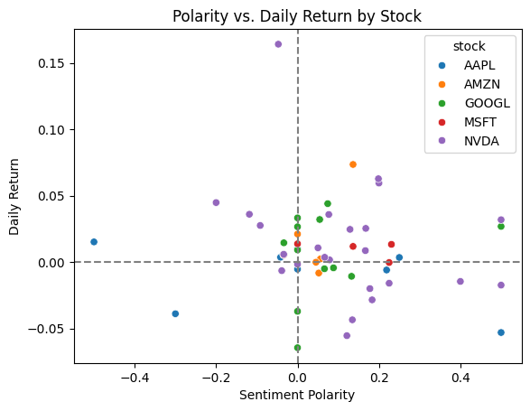

# 🕯️ CandleThrob – Market Sentiment Signal Analysis

---

## 📌 Problem Statement

Retail sentiment is increasingly influential in short-term stock movement. However, there's no clear, visual way to monitor sentiment spikes, trading behavior, and pricing shifts across multiple stocks using social media signals.  
**CandleThrob** aims to close that gap.

---

## 📖 Background

Platforms like Reddit have evolved into real-time trading sentiment hubs. Posts and comment sentiment can preemptively signal market behavior — yet most trading strategies ignore this soft data.

This project analyzes Reddit sentiment for selected stocks, combines it with historical market data, and generates signal scores, visual alerts, and behavioral patterns.

---

## 🔍 Project Overview

CandleThrob scrapes Reddit data for sentiment, merges it with stock price and volume data, and visualizes spikes, correlations, and behavioral insight.

It calculates:
- **Sentiment Polarity & Subjectivity**
- **Daily Return & Volume**
- **Custom Signal Strength**
- **Spike alerts**  
And visualizes all of this across multiple dashboards and Python plots.

---

## 🧰 Tech Stack

- **Python**: Data collection, cleaning, sentiment scoring, spike detection, correlation analysis
- **TextBlob**: NLP sentiment analysis
- **SQLite / CSV**: Data storage and transfer
- **Matplotlib / Seaborn / Plotly**: Exploratory visuals
- **Tableau**: Interactive dashboard building
- **Pandas & NumPy**: Data handling
- **PRAW**: Reddit scraping

---

## 🧠 Executive Summary

CandleThrob found that sentiment spikes from Reddit posts **occasionally coincide with price volatility** or shifts in trading volume — but the correlation is relatively weak overall. However, tracking **sudden polarity spikes** proved useful for **alert-based monitoring**.

---

## 🗂️ Data Structure & Preprocessing

- Raw Reddit data is collected per stock using PRAW (title + text + timestamp)
- Sentiment is scored using `TextBlob` (polarity & subjectivity)
- Market data includes: `close price`, `volume`, `daily return`
- Calculated columns:
  - `avg_sentiment`, `total_mentions`, `signal_strength = avg_sentiment * total_mentions`
  - `daily_return = (price_t - price_t-1) / price_t-1`

Each row represents a **(date, ticker)** pair.

---

## 📊 Evaluation Metrics

- **Sentiment Polarity** → Range: [-1, 1]
- **Subjectivity** → Range: [0, 1]
- **Daily Return** → Price performance metric
- **Volume** → Market interest
- **Signal Strength** → Custom momentum score
- **Spike Detection** → Based on deviation from rolling average

---

## 🔍 Insights

### 1. 📈 Sentiment Spike Detection  
Stocks like NVDA and GOOGL showed frequent polarity spikes.

---

### 2. 🔁 Weak Correlation Across Metrics

Sentiment polarity and daily return showed a weak negative correlation overall.

---

### 3. 📉 Most Returns Cluster Around Neutral Sentiment

- Most return events occur between polarity scores of -0.2 and 0.2
- No clear clustering in positive or negative zones

---

### 4. 📊 Volume Doesn't Always Match Sentiment Hype

AAPL and NVDA's prices moved without consistent Reddit-driven volume spikes.

---

### 5. 🧱 Sentiment Distribution Varies by Stock

NVDA had the most sustained positive sentiment over time.

---

### 6. 🕰️ Sentiment Polarity Over Time

---

## ✅ Recommendations

- **Signal strength alerts** (polarity × mentions) can help surface early retail activity
- Combine this with price/volume breakouts for stronger indicators
- Use as a **filtering layer**, not a sole trading signal

---

## 🚀 How to Run

1. Clone the repo
2. Install dependencies  
3. Set Reddit API credentials in `var.env`
4. Run:
- `reddit_scraper.py` to fetch data
- `sentiment-scoring.ipynb` to process sentiment
- `data-collection.ipynb` to merge with price/volume
5. Export to CSV and open in Tableau
6. Explore interactive dashboards or generate Python plots

---

## ⚠️ Caveats & Assumptions

- Reddit volume ≠ actual market volume
- Sentiment model (TextBlob) may misinterpret sarcasm or slang
- Signal strength isn't normalized across tickers with different audience sizes

---

## 🔮 Future Work

- Integrate Twitter sentiment
- Use VADER or fine-tuned BERT models for sentiment
- Backtest signal spikes against next-day returns
- Build web interface with alerts
- Introduce real-time tracking & update cycles

---

## ✨ Additional Enhancements

- Dynamic threshold control for spike alerts
- Smoother signal strength (EMA or Bollinger Bands)
- Weight sentiment by upvotes/karma
- Add volatility as a secondary signal layer

---

📌 *Created by Adetunji Fasiku*  
*For educational and portfolio purposes. This project explores behavioral finance through data science.*
